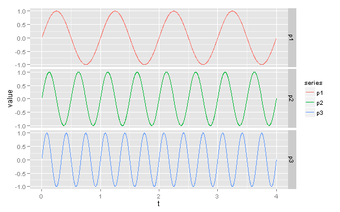
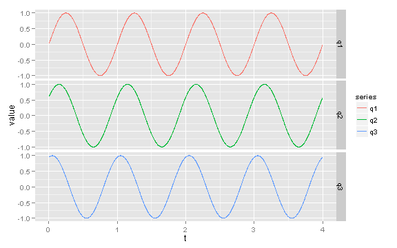

```r
library(plyr)
library(reshape2)
library(knitr)
library(ggplot2)

t <- (1:2000)/500

p1 <- sin(1 * t * 2 * pi)  # freq = 1 Hz
p2 <- sin(2 * t * 2 * pi)  # freq = 2 Hz
p3 <- sin(3 * t * 2 * pi)  # freq = 3 Hz

combined <- data.frame(cbind(t, p1, p2, p3))

long_table <- melt(combined, id.vars = "t", variable.name = "series")

ggplot(long_table, aes(x = t, y = value, color = series)) + geom_line() + facet_grid(series ~ 
    .)
```

 


```r
q1 <- sin(t * 2 * pi)  # phase angle = 0
q2 <- sin(t * 2 * pi + 0.2 * pi)  # phase angle = 0.2 pi
q3 <- sin(t * 2 * pi + 0.4 * pi)  # phase angle = 0.4 pi

combined <- data.frame(cbind(t, q1, q2, q3))

long_table <- melt(combined, id.vars = "t", variable.name = "series")

ggplot(long_table, aes(x = t, y = value, color = series)) + geom_line() + facet_grid(series ~ 
    .)
```

 


```r
r1 <- 0.5 * sin(1 * t * 2 * pi + 0.2 * pi)
r2 <- 0.3 * sin(2 * t * 2 * pi + 0.4 * pi)
r3 <- 0.2 * sin(4 * t * 2 * pi)
r4 <- r1 + r2 + r3

combined <- data.frame(cbind(t, r1, r2, r3, r4))

long_table <- melt(combined, id.vars = "t", variable.name = "series")

ggplot(long_table, aes(x = t, y = value, color = series)) + geom_line() + facet_grid(series ~ 
    .)
```

 

